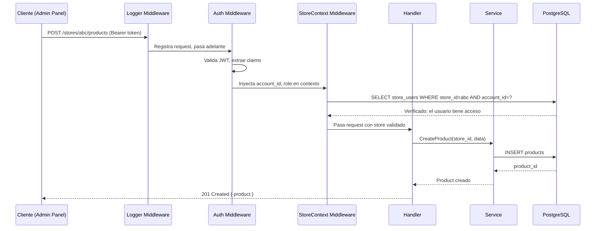

# Capas del Sistema

Cada capa tiene responsabilidades bien definidas. El incumplimiento de estas responsabilidades genera acoplamiento — el mayor riesgo en sistemas distribuidos.

## Capa 1 — Frontends

**Responsabilidad**: Presentar interfaces de usuario. Delegar toda la lógica al Core API.

**Reglas**:
- Solo hace requests HTTP al Core API
- Nunca accede directamente a PostgreSQL
- Nunca publica eventos SQS directamente
- Gestiona estado de UI con React
- Almacena el access token en memoria (no localStorage)

| App | Puerto | Framework | Audiencia |
|---|---|---|---|
| SuperAdmin | 3003 | Next.js 14 | Equipo Go Shopping |
| Admin | 3004 | Next.js 14 | Dueños y operadores de tiendas |
| Storefront | 3005 | Next.js 14 | Clientes finales |

## Capa 2 — Core

**Responsabilidad**: Toda la lógica de negocio. El único servicio que escribe en PostgreSQL.

**Reglas**:
- Es el único servicio con acceso de escritura a PostgreSQL
- Valida autenticación y autorización en cada request
- Verifica `store_id` en cada operación de recursos
- Publica eventos a SQS después de mutaciones de estado
- Nunca llama directamente a servicios externos (Wompi, Siigo, etc.)

**Componentes internos del Core API**:

```
apps/core/internal/
├── config/       # Variables de entorno → struct Config
├── database/     # Pool pgxpool, RunMigrations
├── handlers/     # HTTP handlers (funciones puras)
├── middleware/   # auth, store_context, CORS, logger
├── models/       # Structs de dominio y DTOs
├── router/       # Registro de rutas
└── services/     # Lógica de negocio (AuthService, EventService)
```

## Capa 3 — Integraciones

**Responsabilidad**: Adaptar el sistema a herramientas externas. Consumir eventos SQS.

**Reglas**:
- Solo lee de PostgreSQL (nunca escribe directamente a tablas de negocio)
- Consume mensajes SQS publicados por el Core
- Implementa adapters para cada proveedor externo
- En caso de fallo, el mensaje vuelve a la cola (no se pierde)

**Integrations Service** (`apps/integrations/` — NestJS):
- Modules por proveedor: `WompiModule`, `SiigoModule`, `MetaModule`, etc.
- Cada módulo implementa la interfaz del adapter correspondiente
- Patrón estrategia para intercambiar proveedores

**AI Engine** (`apps/ai-engine/` — Go):
- Genera contenido de tiendas con IA
- Optimización de precios
- Recomendaciones de productos

## Capa 4 — Externos

**Responsabilidad**: Servicios de terceros. Go Shopping no los controla.

**Reglas**:
- Acceso exclusivamente desde la Capa 3
- Las credenciales viven en AWS Secrets Manager
- Cada integración tiene un circuit breaker en el Integrations Service
- Los errores de externos NO deben propagarse al cliente final

## Flujo de una request autenticada


