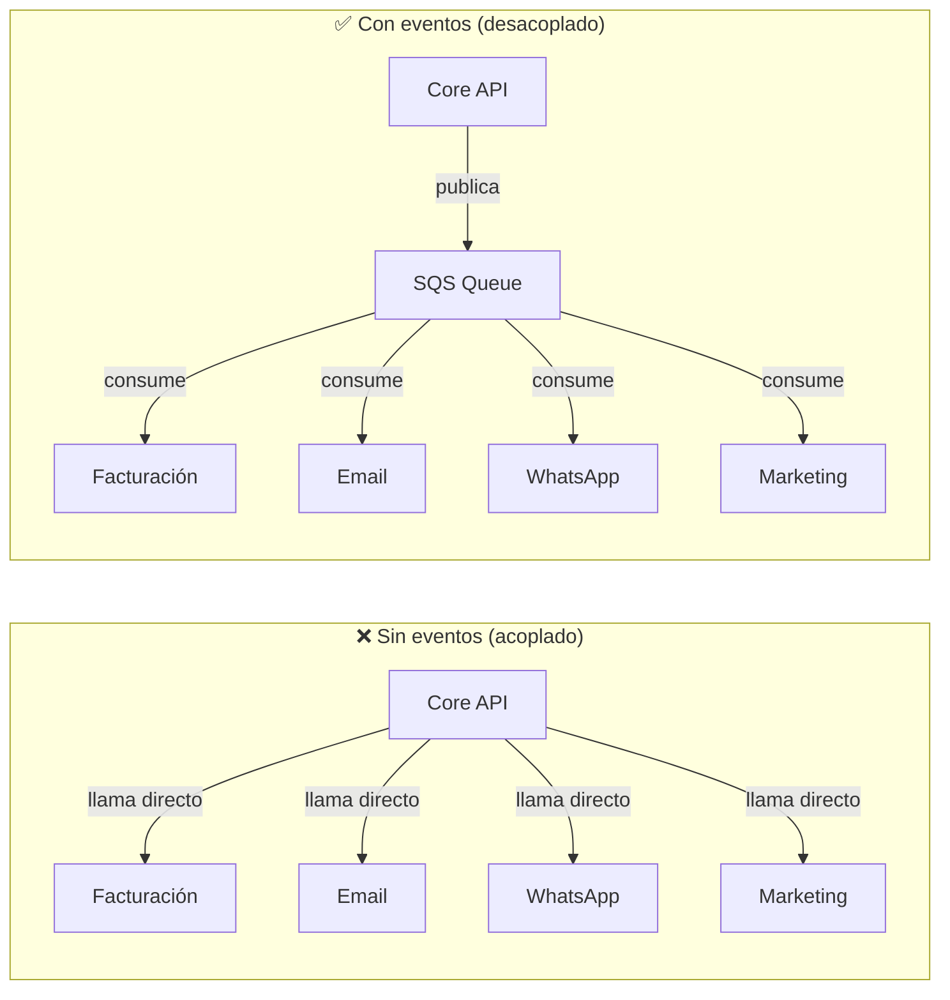
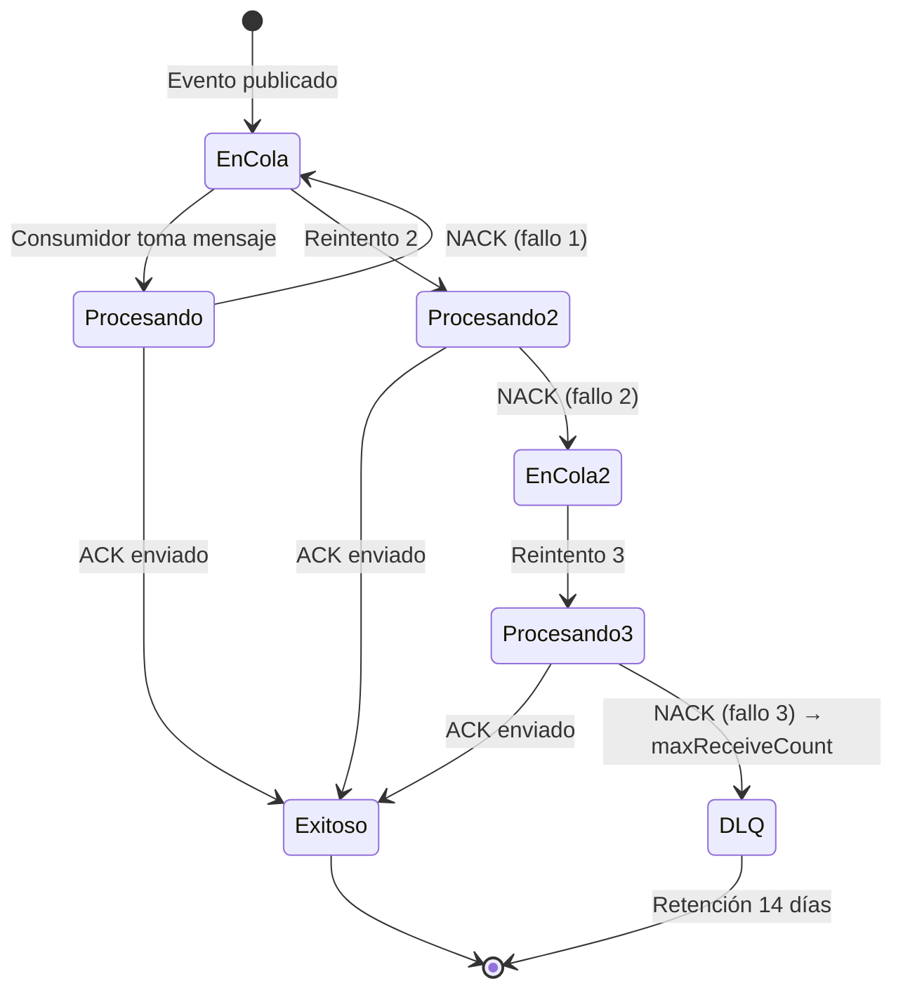

# Arquitectura Event-Driven

Go Shopping usa **AWS SQS** como event bus. Todos los efectos secundarios de una acción de negocio se ejecutan via eventos asincrónicos, nunca en el mismo request HTTP.

## ¿Por qué eventos?



**Ventajas del modelo event-driven**:
- El Core API responde en < 100ms aunque la facturación tarde 2 segundos
- Si Siigo está caído, el mensaje queda en la cola y se procesa cuando vuelva
- Agregar un nuevo consumidor (ej: analytics) no requiere tocar el Core API
- Cada evento queda registrado para auditoría y debugging

## Las 5 Colas de Producción

| Cola | Descripción | Eventos |
|---|---|---|
| `order-events` | Ciclo de vida de pedidos | `order.paid`, `order.preparing`, `order.shipped`, `order.delivered`, `order.cancelled` |
| `payment-events` | Pagos y webhooks | `payment.confirmed`, `payment.failed`, `payment.refunded` |
| `accounting-events` | Contabilidad | `invoice.create`, `invoice.cancel`, `credit_note.create` |
| `notification-events` | Notificaciones | `notify.customer`, `notify.vendor`, `notify.admin` |
| `marketing-events` | Tracking de conversiones | `track.purchase`, `track.add_to_cart`, `track.view_content` |

Cada cola tiene su **DLQ (Dead Letter Queue)** correspondiente:
`order-events-dlq`, `payment-events-dlq`, etc.

## Formato del Mensaje

Todo evento sigue el mismo envelope:

```json
{
  "event_id": "a1b2c3d4-e5f6-7890-abcd-ef1234567890",
  "event_type": "order.paid",
  "store_id": "550e8400-e29b-41d4-a716-446655440000",
  "payload": {
    "order_id": "...",
    "total": 185000,
    "customer_id": "...",
    "items": [...]
  },
  "timestamp": "2026-05-23T18:30:00Z"
}
```

| Campo | Tipo | Descripción |
|---|---|---|
| `event_id` | UUID v4 | Identificador único del evento. Usar para idempotencia. |
| `event_type` | string | Tipo de evento en formato `entidad.accion` |
| `store_id` | UUID | Tienda que originó el evento. Siempre presente. |
| `payload` | object | Datos específicos del evento |
| `timestamp` | RFC3339 | Momento en que ocurrió el evento |

## Política de Reintentos y DLQ



- **maxReceiveCount**: 3 (configurado en `elasticmq.conf`)
- **Retención en DLQ**: 14 días
- **Visibilidad**: 10 segundos por intento
- **Alerta**: cuando un mensaje entra a DLQ, se genera alerta en CloudWatch

## Cómo publicar un evento desde el Core API

```go
// En un handler o service de Go:
err := eventSvc.Publish(
    cfg.SQSOrderEventsURL,
    "order.paid",
    order.StoreID.String(),
    map[string]interface{}{
        "order_id": order.ID,
        "total":    order.Total,
        "customer_id": order.CustomerID,
    },
)
```

El `EventService` en `apps/core/internal/services/event_service.go` se encarga de serializar el envelope y enviarlo a SQS.
