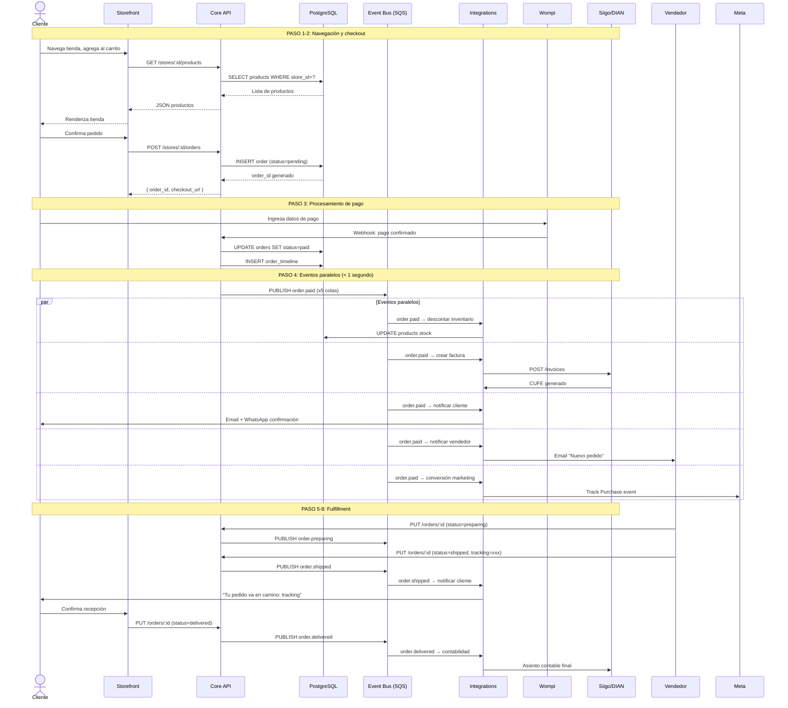

# Flujo de Datos — Una Venta Completa

Este diagrama muestra el ciclo de vida completo de una venta en Go Shopping, desde que el cliente navega la tienda hasta que la contabilidad queda actualizada.

## Diagrama de Secuencia

## Los 8 pasos resumidos

| Paso | Actor | Acción | Resultado |
|---|---|---|---|
| 1 | Cliente | Navega tienda | Productos cargados del Core API |
| 2 | Cliente | Confirma pedido | Orden creada (status=`pending`) |
| 3 | Wompi | Procesa pago | Webhook → orden cambia a `paid` |
| 4 | Sistema | Automático | 5 eventos disparados en paralelo |
| 5 | Vendedor | Alista pedido | Orden cambia a `preparing` |
| 6 | Vendedor | Despacha | Orden cambia a `shipped`, cliente recibe tracking |
| 7 | Cliente | Confirma recepción | Orden cambia a `delivered` |
| 8 | Sistema | Automático | Contabilidad actualizada, asiento creado |

## Garantías del sistema

- **Idempotencia**: cada evento tiene `event_id` UUID. El consumidor verifica si ya procesó ese ID.
- **Reintentos**: máximo 3 intentos antes de ir a DLQ.
- **Orden**: dentro de cada cola SQS los mensajes se procesan en orden de llegada.
- **Timeout**: `defaultVisibilityTimeout = 10 segundos`. Si el consumidor no confirma en 10s, el mensaje vuelve a la cola.
