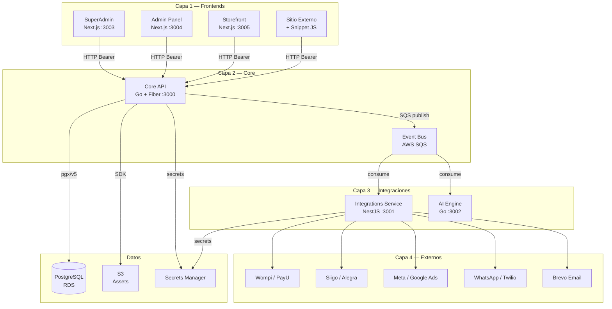

# Visión General de Arquitectura

Go Shopping está organizado en 4 capas bien definidas. Cada capa tiene una responsabilidad única y se comunica con las capas adyacentes via protocolos bien definidos (HTTP/REST, SQS events).

## Diagrama de Arquitectura Completo



## Las 4 Capas

### Capa 1: Frontends
Los tres paneles y el motor de tiendas. Todos son aplicaciones Next.js con React + Tailwind CSS. Se comunican **exclusivamente** con el Core API via HTTP con token Bearer.

- **SuperAdmin** `:3003` — Panel interno del equipo Go Shopping
- **Admin** `:3004` — Panel del dueño/operador de la tienda
- **Storefront** `:3005` — Tienda pública donde compra el cliente final
- **Snippet externo** — JavaScript incrustable en sitios existentes

### Capa 2: Core
El corazón del sistema. Contiene toda la lógica de negocio.

- **Core API** `:3000` — REST API en Go + Fiber. Acceso a PostgreSQL, publicación de eventos SQS.
- **Event Bus** — AWS SQS en producción, ElasticMQ local. 5 colas + 5 DLQs.

### Capa 3: Integraciones
Consumidores de eventos y adaptadores hacia servicios externos.

- **Integrations Service** `:3001` — NestJS. Consume eventos SQS, llama a Wompi/Siigo/Meta/etc.
- **AI Engine** `:3002` — Go. Consume eventos para procesamiento con IA, genera contenido.

### Capa 4: Externos
Servicios de terceros que Go Shopping conecta, pero no construye.

| Servicio | Categoría | Etapa |
|---|---|---|
| Wompi, PayU | Pagos | Etapa 5 |
| Siigo, Alegra | Contabilidad | Etapa 6 |
| Meta Pixel, Google Ads | Marketing | Etapa 8 |
| Twilio (WhatsApp) | Mensajería | Etapa 8 |
| Brevo | Email | Etapa 8 |

## Regla de comunicación entre servicios

```
apps/* ← HTTP/SQS → apps/*   ✅  Solo via protocolos definidos
apps/core → apps/integrations (directo) ❌  NUNCA acceso directo
apps/admin → PostgreSQL (directo)       ❌  NUNCA acceso directo a DB
```

Los servicios se comunican **solo** via el Core API o el Event Bus. Ningún servicio accede directamente a la base de datos de otro servicio.
