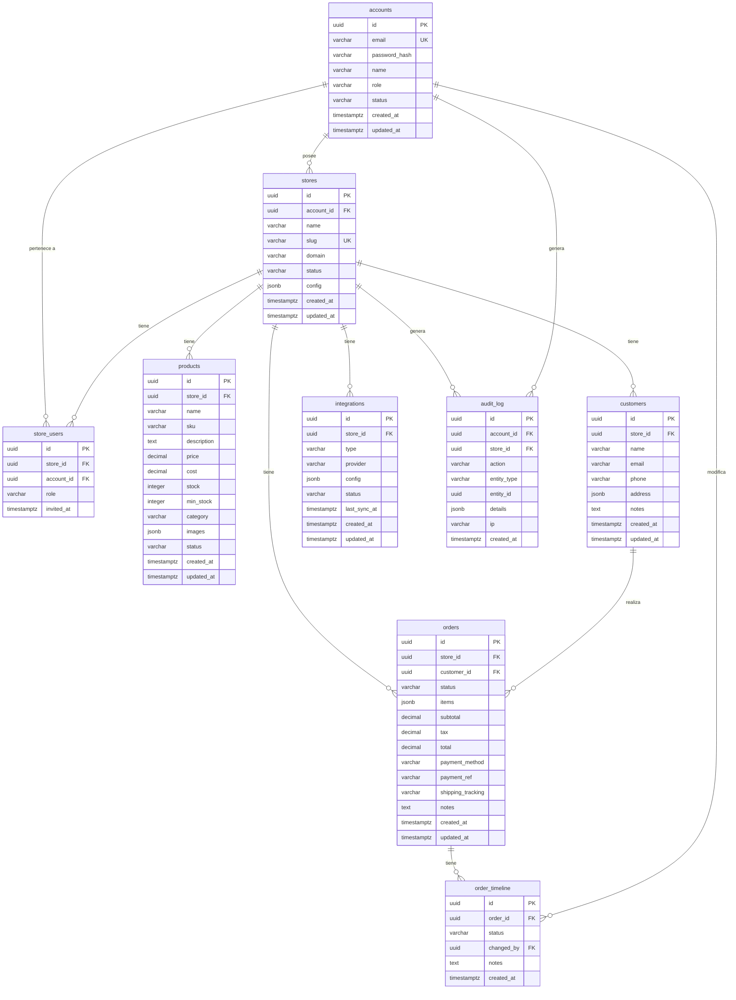

# Esquema General de Base de Datos

Go Shopping usa **PostgreSQL 16** con 9 tablas organizadas en torno al modelo multi-tenant `store_id`.

## Diagrama ER



## Resumen de tablas

| Tabla | Registros típicos | Descripción |
|---|---|---|
| `accounts` | Pequeño | Usuarios del sistema (dueños, operadores, superadmins) |
| `stores` | Pequeño | Tiendas por account |
| `store_users` | Pequeño | Relación many-to-many accounts ↔ stores |
| `products` | Mediano | Catálogo de cada tienda |
| `customers` | Grande | Clientes por tienda |
| `orders` | Grande | Pedidos con estado y líneas |
| `order_timeline` | Grande | Historial de cambios de estado de pedidos |
| `integrations` | Pequeño | Config de integraciones externas por tienda |
| `audit_log` | Muy grande | Log inmutable de acciones sensibles |

## Extensiones habilitadas

```sql
CREATE EXTENSION IF NOT EXISTS "uuid-ossp";  -- uuid_generate_v4()
CREATE EXTENSION IF NOT EXISTS "pgcrypto";   -- gen_random_bytes() para tokens
```
