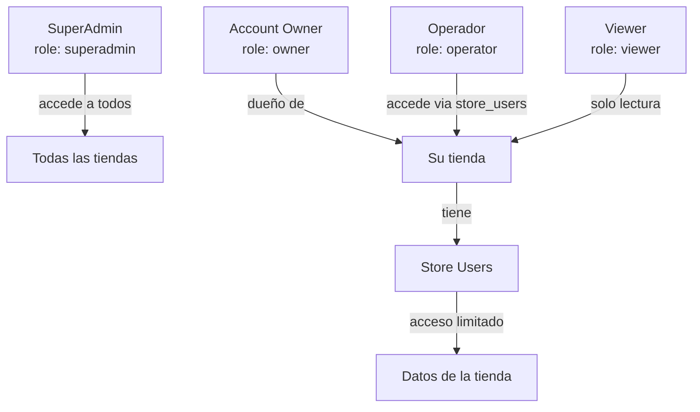

# Multi-Tenancy

Go Shopping es un sistema **multi-tenant** donde cada tienda (`store`) es un tenant aislado. Los datos de una tienda nunca son visibles para otra.

## Modelo de aislamiento

El aislamiento se implementa mediante **Row-Level Filtering**: todas las queries filtran por `store_id`.

```
Un mismo PostgreSQL → Una misma BD → Tablas compartidas → Filas aisladas por store_id
```

Este modelo se denomina **"Shared Database, Shared Schema"** — la opción más eficiente para SaaS B2B de este escala.

## Jerarquía de acceso



## Roles

| Rol | Nivel | Descripción |
|---|---|---|
| `superadmin` | Sistema | Acceso total a todas las tiendas. Solo equipo Go Shopping. |
| `owner` | Cuenta | Dueño de la cuenta. Puede crear tiendas y gestionar store_users. |
| `operator` | Tienda | Operador asignado a una tienda específica. Gestiona operaciones. |
| `viewer` | Tienda | Acceso de solo lectura a una tienda. |

## Cómo funciona en cada request

```go
// middleware/store_context.go
func StoreContextMiddleware(db *pgxpool.Pool) fiber.Handler {
    return func(c *fiber.Ctx) error {
        storeID := c.Params("store_id")
        accountID := c.Locals("account_id").(string)
        
        // Verificar que el account tiene acceso a esta tienda
        var role string
        err := db.QueryRow(ctx,
            "SELECT role FROM store_users WHERE store_id=$1 AND account_id=$2",
            storeID, accountID,
        ).Scan(&role)
        
        if err != nil {
            return c.Status(403).JSON(fiber.Map{"error": "Access denied"})
        }
        
        // Inyectar en el contexto
        c.Locals("store_id", storeID)
        c.Locals("store_role", role)
        return c.Next()
    }
}
```

```go
// En un handler:
func GetProducts(db *pgxpool.Pool) fiber.Handler {
    return func(c *fiber.Ctx) error {
        storeID := c.Locals("store_id").(string)  // Siempre del contexto, nunca del body
        
        rows, _ := db.Query(ctx,
            "SELECT * FROM products WHERE store_id=$1 AND status!='deleted'",
            storeID,  // store_id viene del contexto autenticado
        )
        ...
    }
}
```

## La regla de oro: NUNCA confiar en el store_id del body

```go
// ❌ INCORRECTO — el cliente puede enviar cualquier store_id
storeID := body.StoreID

// ✅ CORRECTO — el store_id viene del middleware de autenticación
storeID := c.Locals("store_id").(string)
```

## Excepciones para SuperAdmin

El middleware de SuperAdmin bypasea la verificación de `store_users`:

```go
role := c.Locals("role").(string)
if role == "superadmin" {
    // Puede acceder a cualquier store_id en la URL
    c.Locals("store_id", c.Params("store_id"))
    return c.Next()
}
// ... verificación normal para otros roles
```
