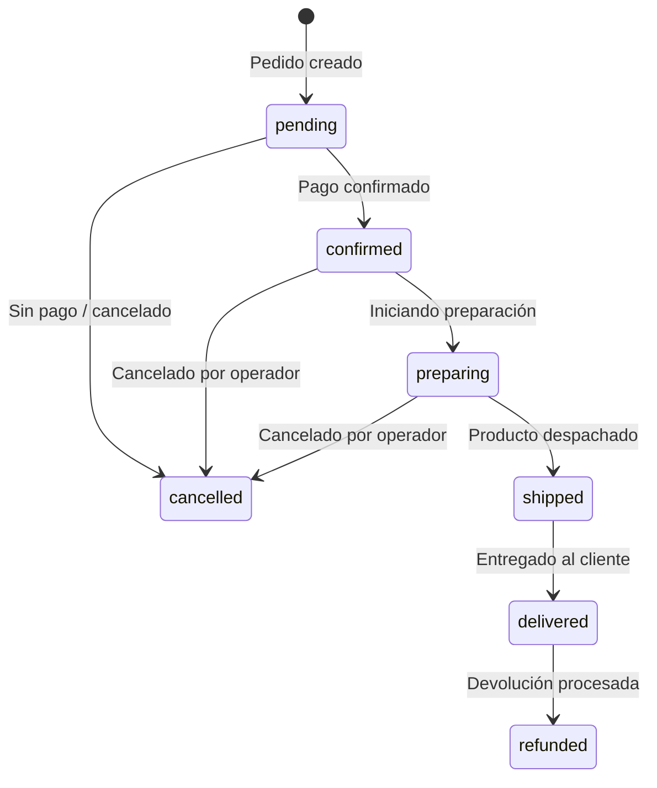

# Tabla: orders

Pedidos de clientes. La tabla más crítica del sistema.

## DDL

```sql
CREATE TABLE orders (
    id               UUID PRIMARY KEY DEFAULT uuid_generate_v4(),
    store_id         UUID NOT NULL REFERENCES stores(id),
    customer_id      UUID REFERENCES customers(id),
    status           VARCHAR(20) NOT NULL DEFAULT 'pending'
                         CHECK (status IN (
                             'pending', 'confirmed', 'preparing',
                             'shipped', 'delivered', 'cancelled', 'refunded'
                         )),
    items            JSONB NOT NULL DEFAULT '[]',
    subtotal         DECIMAL(12,2) NOT NULL,
    tax              DECIMAL(12,2) NOT NULL DEFAULT 0,
    total            DECIMAL(12,2) NOT NULL,
    payment_method   VARCHAR(50),
    payment_ref      VARCHAR(255),
    shipping_tracking VARCHAR(255),
    notes            TEXT,
    created_at       TIMESTAMPTZ NOT NULL DEFAULT NOW(),
    updated_at       TIMESTAMPTZ NOT NULL DEFAULT NOW()
);

CREATE INDEX idx_orders_store_id        ON orders(store_id);
CREATE INDEX idx_orders_store_status    ON orders(store_id, status);
CREATE INDEX idx_orders_store_created   ON orders(store_id, created_at DESC);
CREATE INDEX idx_orders_customer_id     ON orders(customer_id);
```

## Estructura de items (JSONB)

```json
[
  {
    "product_id": "uuid-del-producto",
    "name": "Camiseta Azul Talla M",
    "sku": "CAM-AZ-M",
    "qty": 2,
    "price": 45000,
    "cost": 20000,
    "subtotal": 90000
  }
]
```

Los items son un **snapshot inmutable** del producto al momento de compra. Si el precio del producto cambia después, el pedido conserva el precio original.

## Estados del pedido



## Notas importantes

- `total` = `subtotal` + `tax`. Siempre verificar esta consistencia.
- `payment_ref`: referencia de pago de Wompi u otro proveedor. Útil para debugging.
- Cuando un pedido cambia de status, se registra en `order_timeline`.
- Los cambios de estado también publican eventos a la cola `order-events` en SQS.
