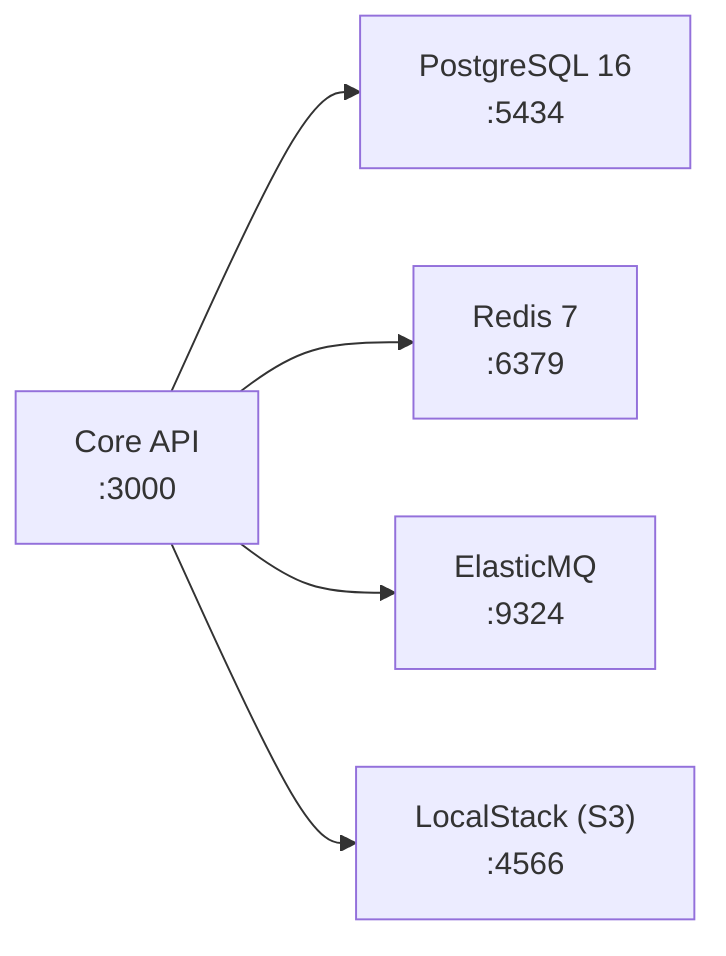

# Docker Local

Detalles sobre el stack Docker de desarrollo local.

## Archivo de configuración

`docker/docker-compose.yml`

## Servicios



## PostgreSQL

:::warning Puerto no estándar: 5434
El puerto externo es `5434`, no `5432`. Esto se debe a que la máquina de desarrollo tiene **PostgreSQL nativo en Windows que ocupa los puertos 5432 y 5433**.

```yaml
# docker/docker-compose.yml
postgres:
  image: postgres:16-alpine
  ports:
    - "5434:5432"   # <-- externo:interno
```

El puerto interno del container sigue siendo 5432. Solo el mapeo externo es 5434.
:::

Configuración completa:
```yaml
postgres:
  image: postgres:16-alpine
  environment:
    POSTGRES_USER: goshopping
    POSTGRES_PASSWORD: localdev123
    POSTGRES_DB: goshopping
  ports:
    - "5434:5432"
  volumes:
    - postgres_data:/var/lib/postgresql/data
    - ./pg_hba.conf:/etc/postgresql/pg_hba.conf
  command: ["postgres", "-c", "hba_file=/etc/postgresql/pg_hba.conf"]
  healthcheck:
    test: ["CMD-SHELL", "pg_isready -U goshopping -d goshopping"]
    interval: 10s
    timeout: 5s
    retries: 5
```

### pg_hba.conf

El archivo `docker/pg_hba.conf` configura autenticación permisiva para desarrollo local:

```
# TYPE  DATABASE        USER            ADDRESS         METHOD
local   all             all                             trust
host    all             all             127.0.0.1/32    trust
host    all             all             ::1/128         trust
host    all             all             0.0.0.0/0       trust
```

:::danger Encoding: LF obligatorio
Este archivo DEBE tener **line endings LF** (Unix). Si está en CRLF (Windows), PostgreSQL Alpine falla silenciosamente. Git puede convertirlos automáticamente — verificar con:
```powershell
(Get-Content docker/pg_hba.conf -Raw) -match "`r`n"
# Si devuelve True → tiene CRLF → problema
```
:::

## Redis

```yaml
redis:
  image: redis:7-alpine
  ports:
    - "6379:6379"
```

Usado en Etapa 3+ para rate limiting y sesiones. En Etapa 1 está disponible pero no se usa.

## ElasticMQ (SQS local)

```yaml
elasticmq:
  image: softwaremill/elasticmq-native:latest
  ports:
    - "9324:9324"
  volumes:
    - ./elasticmq.conf:/opt/elasticmq.conf
```

Simula la API de AWS SQS al 100%. Las 10 colas se crean automáticamente al iniciar.

Ver configuración de colas en `docker/elasticmq.conf`.

**Endpoint**: `http://localhost:9324`

**Listar colas**:
```powershell
curl "http://localhost:9324/?Action=ListQueues"
```

## LocalStack (S3 local)

```yaml
localstack:
  image: localstack/localstack:latest
  ports:
    - "4566:4566"
  environment:
    SERVICES: s3
    DEFAULT_REGION: us-east-1
    AWS_ACCESS_KEY_ID: local-dev
    AWS_SECRET_ACCESS_KEY: local-dev
```

Simula AWS S3 para almacenamiento de imágenes de productos. Usado en Etapa 2+.

**Endpoint**: `http://localhost:4566`

## Comandos útiles

```powershell
# Levantar todo
docker compose -f docker/docker-compose.yml up -d

# Ver estado
docker compose -f docker/docker-compose.yml ps

# Ver logs de un servicio
docker compose -f docker/docker-compose.yml logs -f postgres

# Reiniciar un servicio
docker compose -f docker/docker-compose.yml restart postgres

# Parar todo (sin borrar datos)
docker compose -f docker/docker-compose.yml stop

# Parar y borrar todo (incluyendo volúmenes)
docker compose -f docker/docker-compose.yml down -v

# Conectar a PostgreSQL directamente
docker exec -it docker-postgres-1 psql -U goshopping -d goshopping
```
