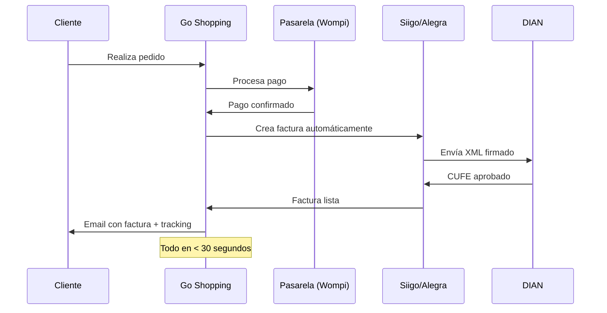

# El problema que resuelve

## El dolor del negocio digital en Colombia

Un negocio que usa Shopify hoy necesita pagar y administrar:

| Herramienta | Costo/mes | Panel |
|---|---|---|
| Shopify (básico) | $39 USD | shopify.com/admin |
| Dropshipping (Oberlo o similar) | $25 USD | oberlo.com |
| Email Marketing (Mailchimp) | $30 USD | mailchimp.com |
| Contabilidad (Siigo Cloud) | $40 USD | siigo.com |
| Meta Ads + Google Analytics | $15 USD | business.facebook.com |
| **Total** | **$149 USD/mes** | **5 paneles distintos** |

**El resultado**: más de $1,700 USD/año en herramientas fragmentadas, operación manual entre plataformas, y un contador que hace asientos contables a mano cada mes.

## El problema crítico: facturación DIAN

En Colombia, **toda venta debe generar factura electrónica** con:
- CUFE (Código Único de Factura Electrónica)
- Código QR validado por la DIAN
- XML firmado con certificado digital del emisor

Con las herramientas actuales, el proceso es:
1. Venta en Shopify → notificación al contador
2. Contador abre Siigo → crea factura manualmente
3. Siigo genera CUFE y XML → envía a la DIAN
4. Contador descarga PDF → lo envía al cliente por email

Esto ocurre **decenas o cientos de veces al mes**, con riesgo de error humano, demoras y multas por facturación fuera de término.

## La solución Go Shopping

**Go Shopping automatiza el ciclo completo**:
- Un solo panel para todo
- Una sola suscripción
- Facturación DIAN automática en < 30 segundos
- Sin intervención humana en operaciones rutinarias

## Diferenciadores clave

1. **Contabilidad automática con software colombiano**: integración nativa con Siigo y Alegra, que son los sistemas certificados por la DIAN que usan el 80% de los contadores en Colombia.

2. **Pensado para Latam desde el día 1**: manejo de IVA colombiano (19%), factura electrónica DIAN, pasarelas locales (Wompi, PayU), y soporte para COP.

3. **Multi-tienda nativo**: desde la primera línea de código, cada recurso tiene `store_id`. Un mismo negocio puede tener 10 marcas en el mismo panel.

4. **Generador de tiendas con IA**: no require diseñador ni desarrollador. La IA genera una tienda optimizada por sector en minutos.
