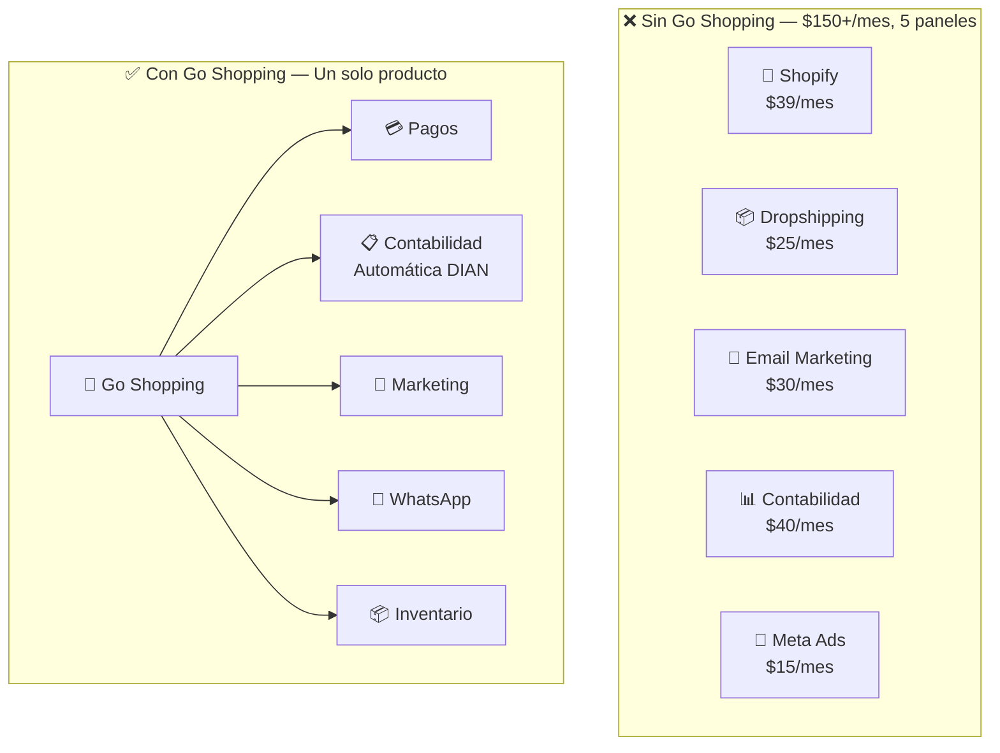

# ¿Qué es Go Shopping?

Go Shopping es un **middleware inteligente de e-commerce** que conecta la tienda digital de un negocio con todas las herramientas que necesita para operar: pagos, contabilidad, marketing, WhatsApp y más.

> **Principio central**: "No reinventamos la rueda — la conectamos."

## Sin Go Shopping vs. Con Go Shopping

## ¿Qué hace Go Shopping?

| Componente | Descripción |
|---|---|
| **Core API** | Gestión de pedidos, inventario, clientes, catálogo |
| **Panel Admin** | Dashboard para el vendedor (dueño de la tienda) |
| **Panel SuperAdmin** | Dashboard interno del equipo Go Shopping |
| **Motor de Tiendas** | Genera tiendas online personalizadas con IA |
| **Integraciones** | Conecta con Wompi, PayU, Siigo, Alegra, Meta, Google, WhatsApp |
| **AI Engine** | Genera contenido, optimiza precios, recomienda productos |

## ¿Qué NO hace Go Shopping?

Go Shopping no construye herramientas que ya existen y están reguladas:

- **No** es un constructor web (Webflow y WordPress ya existen)
- **No** es un sistema contable (Siigo y Alegra están certificados por la DIAN)
- **No** es una pasarela de pagos (regulación financiera Superfinanciera)
- **No** es una plataforma de ads (Meta y Google Ads ya existen)
- **No** es una app de mensajería (WhatsApp API ya existe)

Go Shopping es el **puente** que los conecta todos en un solo producto.

## Mercado objetivo

- Negocios colombianos y latinoamericanos con tiendas online
- PYMES que venden por WhatsApp, Instagram o tienen tienda en Shopify
- Negocios que necesitan facturación electrónica DIAN automática
- Multi-tienda: grupos empresariales con 2-10 marcas
