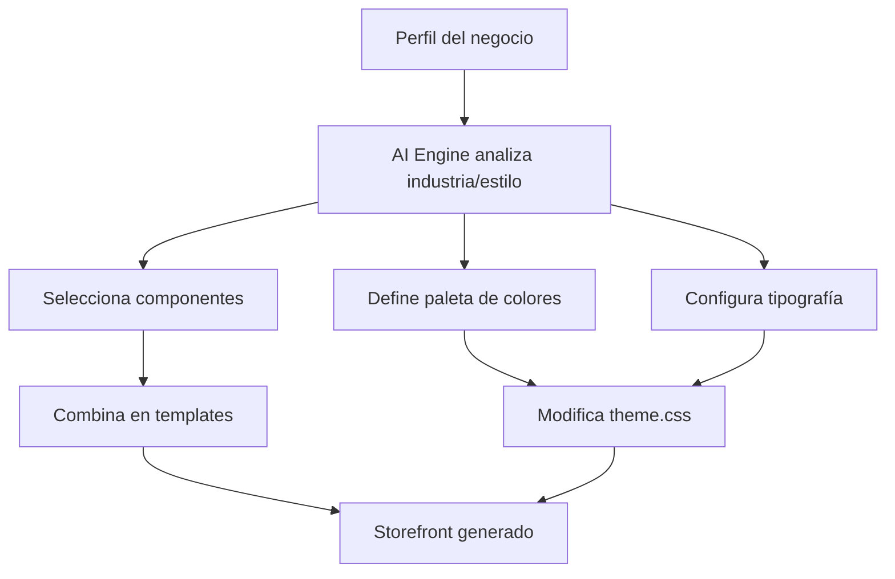

# Storefront Design System

El Design System de GoShopping es una biblioteca de componentes React/Next.js profesional diseñada específicamente para e-commerce colombiano. Vive en `apps/storefront/src/components/` y es el punto de partida que el AI Engine usa para generar storefronts personalizados.

## Arquitectura del Design System

```
apps/storefront/src/
├── components/          ← Componentes del Design System
│   ├── ui/              ← shadcn/ui (29 componentes base)
│   ├── layout/          ← Navbar, Footer, Container
│   ├── hero/            ← 5 variantes de Hero
│   ├── product/         ← ProductCard, ProductGrid, ProductDetail, etc.
│   ├── cart/            ← CartItem, CartDrawer, CartSummary
│   ├── checkout/        ← CheckoutForm, CheckoutSuccess
│   ├── marketing/       ← PromoBanner, CountdownTimer, Newsletter, etc.
│   ├── content/         ← AboutSection, ContactForm, FAQAccordion, BlogCard
│   └── states/          ← LoadingGrid, EmptySearch, ErrorState
├── styles/
│   └── theme.css        ← Variables de personalización para el AI
└── app/
    └── preview/
        └── page.tsx     ← Galería de componentes (Storybook-like)
```

## Variables CSS — API de Personalización del AI

El AI Engine personaliza cada storefront modificando las variables CSS en `src/styles/theme.css`. Esta es la **única API de personalización** — el AI selecciona, combina y configura, nunca diseña desde cero.

### Variables de Marca

```css
:root {
  /* Colores principales (formato HSL sin hsl()) */
  --brand-primary: 142 71% 45%;    /* Verde GoShopping por defecto */
  --brand-secondary: 215 28% 17%;  /* Azul oscuro */
  --brand-accent: 24 95% 53%;      /* Naranja para CTAs */

  /* Tipografía */
  --font-heading: 'Inter', sans-serif;
  --font-body: 'Inter', sans-serif;

  /* Espaciado y layout */
  --section-spacing: 5rem;
  --container-max: 1280px;
  --container-padding: 1.5rem;

  /* Bordes */
  --radius-sm: 0.25rem;
  --radius-md: 0.5rem;
  --radius-lg: 0.75rem;
  --radius-xl: 1rem;
  --radius-full: 9999px;

  /* Sombras */
  --shadow-sm: 0 1px 2px 0 rgb(0 0 0 / 0.05);
  --shadow-md: 0 4px 6px -1px rgb(0 0 0 / 0.1);
  --shadow-lg: 0 10px 15px -3px rgb(0 0 0 / 0.1);
  --shadow-xl: 0 20px 25px -5px rgb(0 0 0 / 0.1);
}
```

### Paletas Preconfiguradas

El AI selecciona entre estas paletas según el tipo de negocio:

| Industria | `--brand-primary` | `--brand-secondary` | `--brand-accent` |
|-----------|-------------------|---------------------|------------------|
| Moda / Ropa | `340 82% 52%` | `340 20% 15%` | `30 90% 55%` |
| Tecnología | `217 91% 60%` | `217 33% 17%` | `160 84% 39%` |
| Artesanal | `25 95% 53%` | `25 40% 20%` | `142 71% 45%` |
| Salud / Bienestar | `142 71% 45%` | `215 28% 17%` | `24 95% 53%` |

## Catálogo de Componentes

### Layout (3 componentes)

| Componente | Descripción | Props clave |
|------------|-------------|-------------|
| `<Container>` | Wrapper responsive con maxWidth y padding | `maxWidth`, `padding` |
| `<Navbar>` | Barra de navegación con 3 variantes | `variant` (transparent/solid/floating), `links`, `cartCount`, `onCartClick` |
| `<Footer>` | Pie de página con 2 variantes | `variant` (full/minimal), `links`, `socialLinks` |

### Hero (5 componentes)

| Componente | Descripción | Cuándo usarlo |
|------------|-------------|---------------|
| `<HeroCentered>` | Centrado, imagen de fondo + overlay | Marcas premium, moda |
| `<HeroSplit>` | 50/50 texto e imagen | Productos específicos |
| `<HeroSlider>` | Carrusel con autoplay (Embla) | Múltiples campañas |
| `<HeroMinimal>` | Fondo sólido, sin imagen | Negocios B2B, minimalistas |
| `<HeroVideo>` | Video de fondo con fallback | Alto impacto visual |

### Producto (5 componentes)

| Componente | Descripción | Props clave |
|------------|-------------|-------------|
| `<ProductCard>` | Tarjeta de producto con AspectRatio 3/4 | `name`, `price`, `originalPrice`, `badge`, `rating`, `onAddToCart` |
| `<ProductGrid>` | Grid responsive con skeleton de carga | `products`, `loading`, `columns` |
| `<ProductDetail>` | Vista detallada con galería y tabs | `product`, `relatedProducts`, `onAddToCart` |
| `<ProductQuickView>` | Dialog de vista rápida | `product`, `open`, `onClose` |
| `<ImageGallery>` | Galería principal + miniaturas | `images`, `alt` |

**Formato de precio:** COP con separador de miles. Ej: `$\u00a089.000`

### Carrito (3 componentes)

| Componente | Descripción | Props clave |
|------------|-------------|-------------|
| `<CartItem>` | Ítem individual del carrito | `id`, `name`, `price`, `quantity`, `onQuantityChange`, `onRemove` |
| `<CartDrawer>` | Panel lateral (Sheet) del carrito | `open`, `onClose`, `items`, `onCheckout` |
| `<CartSummary>` | Resumen con IVA 19% y código descuento | `items`, `discountCode` |

### Checkout (2 componentes)

| Componente | Descripción | Props clave |
|------------|-------------|-------------|
| `<CheckoutForm>` | Formulario completo en 4 secciones | `onSubmit`, `isLoading`, `cartSummary` |
| `<CheckoutSuccess>` | Confirmación de pedido | `orderNumber`, `estimatedDelivery` |

Métodos de pago soportados: Tarjeta crédito/débito, PSE, Contra entrega.

### Marketing (6 componentes)

| Componente | Descripción |
|------------|-------------|
| `<PromoBanner>` | Banner de promoción dismissible |
| `<CountdownTimer>` | Temporizador con días/horas/minutos/segundos |
| `<NewsletterSignup>` | Captura de email (variante inline o banner) |
| `<TestimonialCards>` | Grid de testimonios con calificación |
| `<TrustBadges>` | Iconos de confianza (envío, garantía, pago seguro) |
| `<CategoryShowcase>` | Grid de categorías con imágenes |

### Contenido (4 componentes)

| Componente | Descripción |
|------------|-------------|
| `<AboutSection>` | Sección "Sobre nosotros" con imagen |
| `<ContactForm>` | Formulario de contacto |
| `<FAQAccordion>` | Preguntas frecuentes en acordeón |
| `<BlogCard>` | Tarjeta de artículo de blog |

### Estados (3 componentes)

| Componente | Descripción |
|------------|-------------|
| `<LoadingGrid>` | Skeleton grid para carga de productos |
| `<EmptySearch>` | Estado vacío para búsquedas sin resultados |
| `<ErrorState>` | Estado de error con retry |

## Cómo el AI Engine Genera un Storefront

El flujo de personalización del AI sigue este patrón:



El AI **selecciona y combina** — no diseña desde cero. La calidad visual está garantizada por los componentes del Design System.

### Ejemplo: AI generando un storefront de moda

```typescript
// 1. Selección de componentes
const storeLayout = {
  hero: 'HeroCentered',       // Alta impacto visual
  productGrid: 'ProductGrid', // Standard grid
  marketing: ['PromoBanner', 'CountdownTimer', 'NewsletterSignup'],
};

// 2. Personalización de variables CSS
const brandTheme = `
  --brand-primary: 340 82% 52%;   /* Rosa moda */
  --brand-secondary: 340 20% 15%;
  --font-heading: 'Playfair Display', serif;
  --radius-md: 0.25rem;           /* Bordes más cuadrados = elegancia */
`;
```

## Tecnologías del Design System

| Tecnología | Versión | Uso |
|------------|---------|-----|
| Next.js | 14.2.3 | Framework (App Router) |
| React | 18.x | UI |
| shadcn/ui | latest | 29 componentes base |
| Tailwind CSS | 3.4.3 | Estilos utility-first |
| framer-motion | latest | Animaciones |
| next-themes | latest | Modo oscuro |
| Radix UI | latest | Primitivos accesibles |
| Embla Carousel | latest | Sliders/carruseles |

## Preview del Design System

La página `/preview` en el storefront muestra todos los componentes en un layout interactivo con un selector de paleta de colores:

```
http://localhost:3005/preview
```

Permite cambiar entre 3 paletas predefinidas en tiempo real para visualizar cómo se ve cada componente con diferentes configuraciones de marca.

## Convenciones de Desarrollo

### Agregar un nuevo componente

1. Crear el archivo en la carpeta de categoría correspondiente:
   ```
   apps/storefront/src/components/<categoria>/MiComponente.tsx
   ```

2. Exportar el componente con tipos TypeScript completos.

3. Usar variables CSS para colores de marca (nunca hardcodear colores):
   ```tsx
   // ✅ Correcto
   className="bg-[hsl(var(--brand-primary))]"
   
   // ❌ Incorrecto
   className="bg-green-500"
   ```

4. Agregar `aria-label` a todos los botones de solo icono.

5. Escribir tests en `src/__tests__/`:
   ```tsx
   // apps/storefront/src/__tests__/MiComponente.test.tsx
   ```

6. Agregar demostración en `src/app/preview/page.tsx`.

### Comandos de desarrollo

```bash
# Iniciar storefront en modo desarrollo
cd apps/storefront
npm run dev          # Puerto 3005

# Ejecutar tests
npm test
npm run test:watch
npm run test:coverage

# Agregar componente shadcn
npx shadcn add <nombre-componente>
```

## Tests

El Design System tiene cobertura de tests con Jest + React Testing Library:

```
src/__tests__/
├── ProductCard.test.tsx   (9 tests)
├── ProductGrid.test.tsx   (7 tests)
├── CartDrawer.test.tsx    (6 tests)
├── CheckoutForm.test.tsx  (7 tests)
├── Navbar.test.tsx        (8 tests)
└── HeroCentered.test.tsx  (5 tests)
```

Total: **42 tests** — todos passing.

### Decisiones de testing

- Los botones de solo icono requieren `aria-label` para ser accesibles en tests y por accesibilidad real.
- `ResizeObserver` se polyfill en `jest.setup.ts` (requerido por Radix UI).
- `framer-motion` se mockea globalmente via `moduleNameMapper` en `jest.config.ts`.
