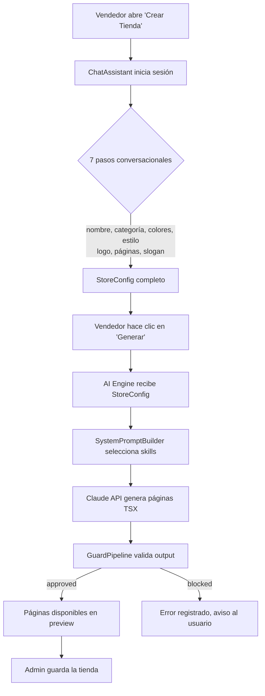
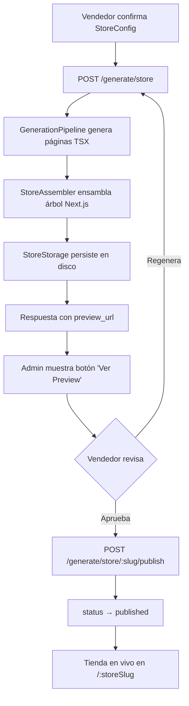

# Generador IA de Tiendas

El generador de tiendas basado en inteligencia artificial permite a los vendedores crear una storefront completa en minutos a través de un asistente conversacional.

## Flujo General



## El Asistente Conversacional

El asistente sigue **7 pasos fijos** en secuencia:

| Paso | Campo | Componente especial |
|------|-------|---------------------|
| 1 | Nombre del negocio | — |
| 2 | Categoría / giro | — |
| 3 | Colores de marca | `ColorPicker` |
| 4 | Estilo visual | `StyleSelector` |
| 5 | Logo (URL o "no") | — |
| 6 | Páginas adicionales | — |
| 7 | Slogan/tagline | — |

### Componentes del Admin Panel

- **`ChatAssistant`** — contenedor principal (split 55/45: chat + preview)
- **`ChatMessage`** — bubble individual (azul oscuro para usuario, blanco para asistente)
- **`StyleSelector`** — tarjetas de los 5 templates (minimal, vibrant, elegant, urban, fresh)
- **`ColorPicker`** — paletas prearmadas por categoría + entrada hex libre
- **`StoreConfigSummary`** — resumen del config antes de generar
- **`GenerationProgress`** — barra de progreso con 4 pasos + botón "Ver preview"
- **`StorePreview`** — mock visual actualizado en tiempo real con los colores y nombre

## Pipeline de Generación

```
StoreConfig
    │
    ▼
SystemPromptBuilder.selectSkills('store')
    ├── LAYOUT_SKILL
    ├── DESIGN_SYSTEM_SKILL
    ├── COMPONENTS_SKILL
    ├── COLOR_ENGINE_SKILL
    ├── TYPOGRAPHY_SKILL
    └── ...
    │
    ▼
SystemPromptBuilder.selectContextDocs('store')
    ├── SECURITY_RULES  ← siempre primero
    ├── API_REFERENCE
    └── TEMPLATE_CATALOG
    │
    ▼
buildStoreGenerationPrompt(config)  ←  por cada página
    │
    ▼
GuardPipeline.validateInput()  ← bloquea prompt injection
    │
    ▼
ClaudeClient.generate()  ← claude-sonnet-4-20250514
    │
    ▼
GuardPipeline.validateOutput()  ← sanitiza output
GuardPipeline.validateCode('tsx')  ← valida que sea TSX válido
    │
    ▼
GeneratedPage { name, code, validated }
```

## Selección de Skills por Categoría

El `SystemPromptBuilder` selecciona skills según el tipo de request:

| Request type | Skills incluidos |
|---|---|
| `store` | LAYOUT, DESIGN_SYSTEM, COMPONENTS, COLOR_ENGINE, TYPOGRAPHY, SEO, ACCESSIBILITY, RESPONSIVE, ECOMMERCE_UX |
| `component` | DESIGN_SYSTEM, COMPONENTS, ACCESSIBILITY, RESPONSIVE |
| `style` | COLOR_ENGINE, TYPOGRAPHY |

## Resolución de Templates

`TemplateResolver` mapea la categoría del negocio al template visual:

| Categoría | Template |
|---|---|
| moda, ropa, belleza | `minimal` |
| joyería, lujo, relojes | `elegant` |
| alimentos, mascotas, hogar | `fresh` |
| tecnología, deportes, electrónica | `vibrant` |
| streetwear, música, arte | `urban` |
| (default) | `minimal` |

## Protección de Seguridad (Guards)

Cada mensaje del usuario y cada respuesta de Claude pasa por la `GuardPipeline`:

1. **`validateInput()`** — detecta prompt injection, override de instrucciones, jailbreak attempts
2. **`validateOutput()`** — sanitiza referencias a imports peligrosos, eval, process.env
3. **`validateCode(code, 'tsx')`** — verifica que el output sea TSX válido y seguro

En `strictMode = true` (default), amenazas de severidad `high` o `critical` bloquean el request.

## API Endpoints

| Método | Endpoint | Auth | Descripción |
|--------|----------|------|-------------|
| `GET` | `/health` | — | Health check del servicio |
| `POST` | `/chat/sessions` | — | Crea nueva sesión de chat |
| `POST` | `/chat/sessions/:id/messages` | — | Envía mensaje al asistente |
| `GET` | `/chat/sessions/:id` | — | Obtiene estado de la sesión |
| `POST` | `/generate/store` | JWT | Genera páginas TSX completas |

### Crear sesión

```http
POST /chat/sessions
Content-Type: application/json

{ "store_id": "abc123" }
```

Respuesta:
```json
{
  "session_id": "uuid",
  "response": "¡Hola! ¿Cómo se llama tu negocio?",
  "step": 0,
  "completed": false
}
```

### Enviar mensaje

```http
POST /chat/sessions/{session_id}/messages
Content-Type: application/json

{ "message": "Tienda de Ropa Moderna" }
```

Respuesta:
```json
{
  "response": "¿Qué vendes? Describe tu negocio en pocas palabras.",
  "step": 1,
  "completed": false,
  "store_config": { "name": "Tienda de Ropa Moderna" }
}
```

### Generar tienda

```http
POST /generate/store
Authorization: Bearer <JWT>
Content-Type: application/json

{
  "store_config": {
    "name": "Mi Tienda",
    "category": "moda",
    "style": "minimal",
    "colors": { "primary": "220 14% 96%", "secondary": "220 9% 46%", "accent": "262 83% 57%" },
    "pages": ["inicio", "catalogo"]
  },
  "store_slug": "mi-tienda",
  "store_id": "store-001"
}
```

Respuesta:
```json
{
  "success": true,
  "pages": [
    { "name": "HomePage", "code": "...", "validated": true },
    { "name": "CatalogPage", "code": "...", "validated": true }
  ],
  "css_variables": {
    "--brand-primary": "220 14% 96%",
    "--font-heading": "Inter",
    "--font-body": "Inter"
  },
  "errors": [],
  "threat_count": 0
}
```

## Variables CSS Generadas

El pipeline genera CSS variables basadas en el `StoreConfig`:

```css
:root {
  --brand-primary: <primary HSL>;
  --brand-secondary: <secondary HSL>;
  --brand-accent: <accent HSL>;
  --font-heading: <heading font>;
  --font-body: <body font>;
}
```

Fuentes por estilo:

| Estilo | Heading | Body |
|--------|---------|------|
| minimal | Inter | Inter |
| vibrant | Poppins | Inter |
| elegant | Cormorant Garamond | Lato |
| urban | Space Grotesk | Space Grotesk |
| fresh | Nunito | Nunito |

## Preview y Publicación

Una vez que el pipeline genera las páginas, el sistema las ensambla, las persiste y las sirve como una URL de preview antes de publicar.

### Flujo completo (Etapa 7G)



### StoreAssembler

`StoreAssembler` toma el `StoreGenerationResult` y produce un árbol de archivos Next.js:

| Archivo generado | Tipo | Descripción |
|---|---|---|
| `app/layout.tsx` | layout | Root layout con CSS vars inline y CartProvider |
| `app/globals.css` | style | CSS variables de marca y reset base |
| `app/providers/CartProvider.tsx` | component | Context provider de carrito |
| `lib/store-config.ts` | config | Config del store como módulo exportable |
| `app/(store)/layout.tsx` | layout | Layout de la tienda con Navbar y Footer |
| `app/page.tsx` | page | Página de inicio (HomePage) |
| `app/catalogo/page.tsx` | page | Catálogo de productos |
| `app/producto/[id]/page.tsx` | page | Detalle de producto |
| `app/checkout/page.tsx` | page | Checkout |
| `app/nosotros/page.tsx` | page | About (opcional) |
| `app/contacto/page.tsx` | page | Contacto (opcional) |
| `app/faq/page.tsx` | page | FAQ (opcional) |

Mapeo de nombres de página a rutas:

| Página | Ruta |
|--------|------|
| `HomePage` | `/` |
| `CatalogPage` | `catalogo` |
| `ProductPage` | `producto/[id]` |
| `CheckoutPage` | `checkout` |
| `AboutPage` | `nosotros` |
| `ContactPage` | `contacto` |
| `FAQPage` | `faq` |

### StoreStorage

`StoreStorage` persiste los stores ensamblados en el sistema de archivos:

- **Base path**: `STORES_PATH` env var (default `/tmp/goshopping-stores`)
- **Estructura**: `{basePath}/{storeSlug}/` con todos los archivos Next.js + `store-meta.json`
- **Versioning**: auto-incremental (`v1`, `v2`…) — re-generar crea nueva versión
- **Estados**: `preview` → `published` → `archived`

```
/tmp/goshopping-stores/
└── mi-tienda/
    ├── store-meta.json       ← StoredStore metadata
    ├── app/
    │   ├── layout.tsx
    │   ├── globals.css
    │   ├── providers/
    │   │   └── CartProvider.tsx
    │   ├── page.tsx
    │   └── catalogo/
    │       └── page.tsx
    └── lib/
        └── store-config.ts
```

### Rutas Dinámicas del Storefront

El storefront (`apps/storefront/`) sirve las tiendas publicadas bajo `/:storeSlug`:

| Ruta | Archivo | Descripción |
|------|---------|-------------|
| `/:storeSlug` | `app/[storeSlug]/page.tsx` | Página de inicio con HeroCentered + ProductGrid |
| `/:storeSlug/catalogo` | `app/[storeSlug]/catalogo/page.tsx` | Catálogo con búsqueda y filtros |
| `/:storeSlug/producto/:id` | `app/[storeSlug]/producto/[id]/page.tsx` | Detalle de producto |
| `/:storeSlug/checkout` | `app/[storeSlug]/checkout/page.tsx` | Checkout con resumen de carrito |
| `/:storeSlug/nosotros` | `app/[storeSlug]/nosotros/page.tsx` | Página Nosotros |
| `/:storeSlug/contacto` | `app/[storeSlug]/contacto/page.tsx` | Formulario de contacto |

El layout `app/[storeSlug]/layout.tsx` usa `useStoreConfig(storeSlug)` para aplicar los CSS vars de marca dinámicamente vía `document.documentElement.style.setProperty`.

### Nuevos Endpoints (Etapa 7G)

| Método | Endpoint | Auth | Descripción |
|--------|----------|------|-------------|
| `POST` | `/generate/store` | JWT | Genera + ensambla + persiste la tienda |
| `POST` | `/generate/store/:storeSlug/publish` | JWT | Publica la tienda (status → published) |
| `GET` | `/generate/store/:storeSlug/status` | JWT | Consulta estado y URLs de la tienda |
| `DELETE` | `/generate/store/:storeSlug` | JWT | Archiva la tienda |

#### Publicar tienda

```http
POST /generate/store/mi-tienda/publish
Authorization: Bearer <JWT>
```

Respuesta:
```json
{
  "success": true,
  "store_slug": "mi-tienda",
  "status": "published",
  "url": "https://app.goshopping.co/mi-tienda",
  "published_at": "2025-08-10T15:30:00.000Z"
}
```

#### Consultar estado

```http
GET /generate/store/mi-tienda/status
Authorization: Bearer <JWT>
```

Respuesta:
```json
{
  "store_slug": "mi-tienda",
  "status": "preview",
  "version": "v1",
  "preview_url": "http://localhost:3004/mi-tienda",
  "created_at": "2025-08-10T15:00:00.000Z"
}
```

### Variables de Entorno del AI Engine

| Variable | Default | Descripción |
|----------|---------|-------------|
| `STORES_PATH` | `/tmp/goshopping-stores` | Directorio donde se persisten los stores |
| `STOREFRONT_BASE_URL` | `http://localhost:3004` | URL interna del storefront (previews) |
| `STOREFRONT_PUBLIC_URL` | `http://localhost:3004` | URL pública del storefront (tiendas publicadas) |
