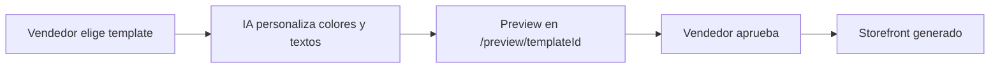

# Templates de Storefront

GoShopping incluye 5 templates visuales preconfigurados. Cada template define la personalidad completa de una tienda: colores, tipografía, estructura de la homepage y variantes de componentes. El AI Engine los usa como punto de partida para la personalización.

## ¿Cómo funciona?



La personalización es **solo CSS variables** — el código no cambia. El AI Engine modifica los tokens en `theme.css` y el Design System se adapta automáticamente.

## Los 5 Templates

### 1. Minimal

> *Limpio, tipografía grande, mucho espacio blanco.*

**Personalidad:** Elegancia sin ruido. Cada elemento tiene su espacio.  
**Inspiración:** Apple Store, Aesop, COS  
**Industrias:** Moda premium, Joyería, Cosmética, Arte, Diseño

| Propiedad | Valor |
|-----------|-------|
| Tipografía heading | Playfair Display (serif) |
| Tipografía body | Inter |
| Navbar | `transparent` |
| Hero | `split` |
| Footer | `minimal` |
| Bordes | `sharp` (rectos) |
| Sombras | `none` |
| Espaciado | `6rem` |

**Secciones de la home:**
1. HeroSplit
2. CategoryShowcase
3. ProductGrid (4 productos, 2 cols)
4. AboutSection
5. TestimonialCards
6. NewsletterSignup

---

### 2. Vibrant

> *Colores fuertes, energía, CTAs agresivos.*

**Personalidad:** Urgencia de compra. Lleno de contenido y acción.  
**Inspiración:** Nike, Adidas, Best Buy  
**Industrias:** Deportes, Tecnología, Gadgets, Fitness, Streetwear

| Propiedad | Valor |
|-----------|-------|
| Colores | Azul eléctrico (#2563EB) + naranja (#F97316) |
| Tipografía heading | Space Grotesk (bold sans) |
| Tipografía body | Inter |
| Navbar | `solid` (azul fuerte) |
| Hero | `slider` (3 slides con ofertas) |
| Footer | `full` |
| Bordes | `rounded` |
| Sombras | `medium` |
| Espaciado | `4rem` |

**Secciones de la home:**
1. PromoBanner
2. HeroSlider (3 slides)
3. CategoryShowcase
4. ProductGrid "Lo más vendido"
5. CountdownTimer
6. ProductGrid "Recién llegados"
7. TrustBadges
8. TestimonialCards
9. NewsletterSignup

---

### 3. Elegant

> *Serif, fondos oscuros opcionales, sofisticación.*

**Personalidad:** Lujo accesible. Cada pixel comunica premium.  
**Inspiración:** Dior, Nespresso, Four Seasons  
**Industrias:** Vinos, Gastronomía, Hoteles, Moda de lujo, Perfumería

| Propiedad | Valor |
|-----------|-------|
| Colores | Dorado (#c9a96e) sobre crema (#faf7f2) |
| Tipografía heading | Cormorant Garamond (serif elegante) |
| Tipografía body | Lora |
| Navbar | `transparent` |
| Hero | `centered` (imagen full con overlay) |
| Footer | `full` (fondo oscuro) |
| Bordes | `sharp` |
| Sombras | `subtle` |
| Espaciado | `5rem` |

**Secciones de la home:**
1. HeroCentered
2. ProductGrid "Colección exclusiva"
3. AboutSection
4. CategoryShowcase
5. TestimonialCards
6. NewsletterSignup

---

### 4. Urban

> *Bold, directo, impactante. Estilo streetwear.*

**Personalidad:** Joven y atrevido. Nada de convenciones.  
**Inspiración:** Supreme, Palace, Bape  
**Industrias:** Streetwear, Skate, Música, Arte urbano, Sneakers

| Propiedad | Valor |
|-----------|-------|
| Colores | Negro + amarillo (#FACC15) |
| Tipografía heading | Bebas Neue (condensed bold) |
| Tipografía body | DM Sans |
| Navbar | `floating` (separado, con borde) |
| Hero | `minimal` (fondo sólido, texto gigante) |
| Footer | `minimal` (negro) |
| Bordes | `rounded` |
| Sombras | `dramatic` |
| Espaciado | `3rem` (compacto) |

**Secciones de la home:**
1. HeroMinimal
2. ProductGrid (grid asimétrico)
3. PromoBanner
4. CategoryShowcase
5. ProductGrid "Drop reciente"
6. TrustBadges

---

### 5. Fresh

> *Colores pastel, bordes redondeados, cálido y accesible.*

**Personalidad:** Amigable y confiable. Para el día a día.  
**Inspiración:** Notion, Slack, Headspace  
**Industrias:** Alimentos, Bebidas, Productos naturales, Bebés, Mascotas, Hogar

| Propiedad | Valor |
|-----------|-------|
| Colores | Verde suave (#059669) + rosa (#EC4899) sobre crema (#FFF8F0) |
| Tipografía heading | Nunito (rounded sans) |
| Tipografía body | Nunito Sans |
| Navbar | `solid` (blanco, bordes suaves) |
| Hero | `split` (foto lifestyle) |
| Footer | `full` (fondo pastel) |
| Bordes | `pill` (muy redondeado) |
| Sombras | `subtle` |
| Espaciado | `4rem` |

**Secciones de la home:**
1. HeroSplit
2. TrustBadges
3. CategoryShowcase
4. ProductGrid "Favoritos"
5. AboutSection
6. TestimonialCards
7. FAQAccordion
8. NewsletterSignup
9. ContactForm

---

## Estructura de archivos

```
apps/storefront/src/templates/
├── types.ts              ← Interfaz TemplateConfig
├── index.ts              ← Exports: templates, getTemplate(), getTemplatesForCategory()
├── minimal/
│   └── config.ts
├── vibrant/
│   └── config.ts
├── elegant/
│   └── config.ts
├── urban/
│   └── config.ts
└── fresh/
    └── config.ts
```

## Interfaz TemplateConfig

```typescript
interface TemplateConfig {
  id: string;
  name: string;
  description: string;
  category: string[];           // Industrias recomendadas

  colors: {
    primary: string;            // HSL sin hsl(), e.g. "142 71% 45%"
    primaryForeground: string;
    secondary: string;
    secondaryForeground: string;
    accent: string;
    accentForeground: string;
    background: string;
    foreground: string;
    muted: string;
  };

  fonts: {
    heading: string;            // Google Font name
    body: string;
  };

  components: {
    navbar: 'transparent' | 'solid' | 'floating';
    hero: 'centered' | 'split' | 'slider' | 'minimal' | 'video';
    footer: 'full' | 'minimal';
    productCard: 'compact' | 'expanded';
  };

  homeSections: string[];       // Orden de secciones en la home

  style: {
    sectionSpacing: string;     // CSS value, e.g. "5rem"
    borderRadius: 'sharp' | 'rounded' | 'pill';
    shadows: 'none' | 'subtle' | 'medium' | 'dramatic';
  };
}
```

## API de utilidades

```typescript
import { getTemplate, getTemplatesForCategory, templateList } from '@/templates';

// Obtener un template por ID
const config = getTemplate('minimal');        // TemplateConfig
getTemplate('nonexistent');                   // throws Error

// Filtrar templates por industria
const moda = getTemplatesForCategory('Moda premium');  // TemplateConfig[]

// Lista de todos los templates
templateList.forEach(t => console.log(t.id));
```

## Cómo se aplican los CSS variables

La función `buildTemplateCSSVars()` convierte un `TemplateConfig` en un objeto de CSS custom properties:

```typescript
import { buildTemplateCSSVars } from '@/lib/template-css';

const cssVars = buildTemplateCSSVars(minimalConfig);
// {
//   '--brand-primary': '0 0% 9%',
//   '--brand-accent': '39 45% 62%',
//   '--font-heading': 'var(--font-playfair-display)',
//   '--radius-md': '0.25rem',
//   '--shadow-md': 'none',
//   ...
// }

// Aplicar como inline style en un wrapper div:
<div style={cssVars as React.CSSProperties}>
  {/* Todos los componentes dentro usan los vars del template */}
</div>
```

### Mapeo de tokens

| `TemplateConfig` | CSS Variable |
|---|---|
| `colors.primary` | `--brand-primary` |
| `colors.accent` | `--brand-accent` |
| `colors.background` | `--surface-background` |
| `fonts.heading` | `--font-heading` |
| `fonts.body` | `--font-body` |
| `style.sectionSpacing` | `--section-spacing` |
| `style.borderRadius: 'sharp'` | `--radius-md: 0.25rem` |
| `style.borderRadius: 'pill'` | `--radius-md: 1.25rem` |
| `style.shadows: 'none'` | `--shadow-*: none` |
| `style.shadows: 'dramatic'` | `--shadow-*: strong values` |

## Rutas de preview

| Ruta | Descripción |
|------|-------------|
| `/preview` | Grid con los 5 templates — selector para el vendedor |
| `/preview/minimal` | Preview completo del template Minimal |
| `/preview/vibrant` | Preview completo del template Vibrant |
| `/preview/elegant` | Preview completo del template Elegant |
| `/preview/urban` | Preview completo del template Urban |
| `/preview/fresh` | Preview completo del template Fresh |
| `/design-system` | Galería de todos los componentes del Design System |

## Google Fonts configuradas

Todas las fuentes se cargan via `next/font/google` en `layout.tsx` y se exponen como CSS variables:

| Font | CSS Variable | Template |
|------|-------------|---------|
| Inter | `--font-inter` | Todos (body por defecto) |
| Playfair Display | `--font-playfair-display` | Minimal |
| Space Grotesk | `--font-space-grotesk` | Vibrant |
| Cormorant Garamond | `--font-cormorant-garamond` | Elegant |
| Lora | `--font-lora` | Elegant (body) |
| Bebas Neue | `--font-bebas-neue` | Urban |
| DM Sans | `--font-dm-sans` | Urban (body) |
| Nunito | `--font-nunito` | Fresh |
| Nunito Sans | `--font-nunito-sans` | Fresh (body) |

## Cómo agregar un nuevo template

1. Crear `src/templates/mi-template/config.ts` con la estructura `TemplateConfig`
2. Importar y registrar en `src/templates/index.ts`:
   ```typescript
   import { miTemplateConfig } from './mi-template/config';
   export const templates = {
     // ...existentes
     'mi-template': miTemplateConfig,
   };
   ```
3. Agregar los Google Fonts necesarios en `src/app/layout.tsx`
4. El template aparece automáticamente en `/preview` y funciona con `getTemplate()` y `getTemplatesForCategory()`

No hay que tocar el código de la página de preview ni el sistema de CSS variables.
